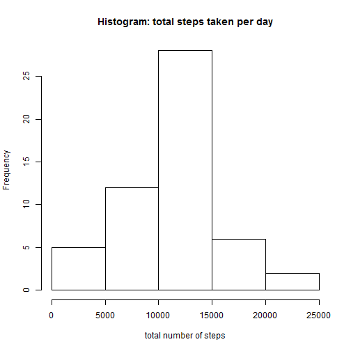

## Loading and preprocessing the data
I will load the libraries that will be used in this assignment as well as 
set the LocalTime to get weekdays in English

```r
library(knitr)
library(dplyr)
library(lattice)
Sys.setlocale("LC_TIME", "English")
```

```
## [1] "English_United States.1252"
```
Here I will read the data and store in a variable. Missing days (NA values) will be ignored


```r
dataOriginal <- read.csv(file="./data/activity.csv", head=TRUE, sep=",")
data <- na.omit(dataOriginal)
head(data)
```

```
##     steps       date interval
## 289     0 2012-10-02        0
## 290     0 2012-10-02        5
## 291     0 2012-10-02       10
## 292     0 2012-10-02       15
## 293     0 2012-10-02       20
## 294     0 2012-10-02       25
```

```r
names(data)
```

```
## [1] "steps"    "date"     "interval"
```

## What is mean total number of steps taken per day?
This assignment description is:

1. Calculate the total number of steps taken per day

2. If you do not understand the difference between a histogram and a barplot, research
the difference between them. Make a histogram of the total number of steps taken each
day

3. Calculate and report the mean and median of the total number of steps taken per day


```r
total_steps <- aggregate(steps ~ date, data=data, FUN=sum)

# Total number of steps per day
total_steps
```

```
##          date steps
## 1  2012-10-02   126
## 2  2012-10-03 11352
## 3  2012-10-04 12116
## 4  2012-10-05 13294
## 5  2012-10-06 15420
## 6  2012-10-07 11015
## 7  2012-10-09 12811
## 8  2012-10-10  9900
## 9  2012-10-11 10304
## 10 2012-10-12 17382
## 11 2012-10-13 12426
## 12 2012-10-14 15098
## 13 2012-10-15 10139
## 14 2012-10-16 15084
## 15 2012-10-17 13452
## 16 2012-10-18 10056
## 17 2012-10-19 11829
## 18 2012-10-20 10395
## 19 2012-10-21  8821
## 20 2012-10-22 13460
## 21 2012-10-23  8918
## 22 2012-10-24  8355
## 23 2012-10-25  2492
## 24 2012-10-26  6778
## 25 2012-10-27 10119
## 26 2012-10-28 11458
## 27 2012-10-29  5018
## 28 2012-10-30  9819
## 29 2012-10-31 15414
## 30 2012-11-02 10600
## 31 2012-11-03 10571
## 32 2012-11-05 10439
## 33 2012-11-06  8334
## 34 2012-11-07 12883
## 35 2012-11-08  3219
## 36 2012-11-11 12608
## 37 2012-11-12 10765
## 38 2012-11-13  7336
## 39 2012-11-15    41
## 40 2012-11-16  5441
## 41 2012-11-17 14339
## 42 2012-11-18 15110
## 43 2012-11-19  8841
## 44 2012-11-20  4472
## 45 2012-11-21 12787
## 46 2012-11-22 20427
## 47 2012-11-23 21194
## 48 2012-11-24 14478
## 49 2012-11-25 11834
## 50 2012-11-26 11162
## 51 2012-11-27 13646
## 52 2012-11-28 10183
## 53 2012-11-29  7047
```

```r
# Histogram
hist(total_steps$steps, main="Histogram: total steps taken per day", xlab="total number of steps")
```

 

```r
# Mean and median

mean(total_steps$steps)
```

```
## [1] 10766.19
```

```r
median(total_steps$steps)
```

```
## [1] 10765
```


## What is the average daily activity pattern?
This assignment description is:

1. Make a time series plot (i.e. type = "l") of the 5-minute interval (x-axis)
and the average number of steps taken, averaged across all days (y-axis)

2. Which 5-minute interval, on average across all the days in the dataset, contains
the maximum number of steps?


```r
activity <- aggregate(steps ~ interval, data=data, FUN=mean, na.rm=TRUE)

plot(activity$interval, activity$steps, type='l', col=1,
   main="Average number of steps", xlab="Interval",
   ylab="Average number of steps")
```

 

```r
max_steps_in_interval_row <- which.max(activity$steps)

# 5-minute interval desired
activity[max_steps_in_interval_row, ]
```

```
##     interval    steps
## 104      835 206.1698
```

## Imputing missing values
This assignment description is:

1. Calculate and report the total number of missing values in the dataset (i.e.
  the total number of rows with NAs)

2. Devise a strategy for filling in all of the missing values in the dataset. The
strategy does not need to be sophisticated. For example, you could use the
mean/median for that day, or the mean for that 5-minute interval, etc.

3. Create a new dataset that is equal to the original dataset but with the missing
data filled in.

4. Make a histogram of the total number of steps taken each day and Calculate and
report the mean and median total number of steps taken per day. Do these values
differ from the estimates from the first part of the assignment? What is the impact
of imputing missing data on the estimates of the total daily number of steps?


```r
NA_counter <- sum(is.na(dataOriginal))

#number of NAs
NA_counter
```

```
## [1] 2304
```

```r
#fill NA with mean of steps per interval in day
mean_activity <- aggregate(steps ~ interval, data=data, FUN=mean, na.rm=TRUE)
new_data <- dataOriginal
for (i in 1:nrow(dataOriginal)) {
  if(is.na(dataOriginal$steps[i])) {
    interval <- dataOriginal$interval[i]
    interval_row <- which(mean_activity$interval == interval)
    step <- mean_activity$steps[interval_row]
    new_data$steps[i] <- step
  }
}

new_activity <- aggregate(steps ~ date, data=new_data, FUN=sum, na.rm=TRUE)
hist(new_activity$steps, main = "Total steps by day")
```

 

```r
#new mean
mean(new_activity$steps)
```

```
## [1] 10766.19
```

```r
#new median
median(new_activity$steps)
```

```
## [1] 10766.19
```

The average value remains the sam after filling NA values, but the median value
changed a little bit, it became equal to the average value.

## Are there differences in activity patterns between weekdays and weekends?
This assignment description is:

1. Create a new factor variable in the dataset with two levels - "weekday" and
"weekend" indicating whether a given date is a weekday or weekend day.

2. Make a panel plot containing a time series plot (i.e. type = "l") of the 5-minute
interval (x-axis) and the average number of steps taken, averaged across all weekday
days or weekend days (y-axis).


```r
new_data$date <- as.Date(new_data$date, "%Y-%m-%d")
day <- weekdays(new_data$date)
day_type <- vector()
for (i in 1:nrow(new_data)) {
  if(day[i] == "Saturday" || day[i] == "Sunday") {
    day_type[i] <- 'weekend'
  } else {
    day_type[i] <- 'weekday'
  }
}

new_data$day_type <- day_type
new_data$day_type <- factor(new_data$day_type)

steps_per_day <- aggregate(steps ~ interval + day_type, data=new_data, na.rm=TRUE, FUN=mean)
xyplot(steps ~ interval | day_type, steps_per_day, type = "l", layout = c(1, 2),
  xlab = "Interval", ylab = "Number of steps")
```

 
